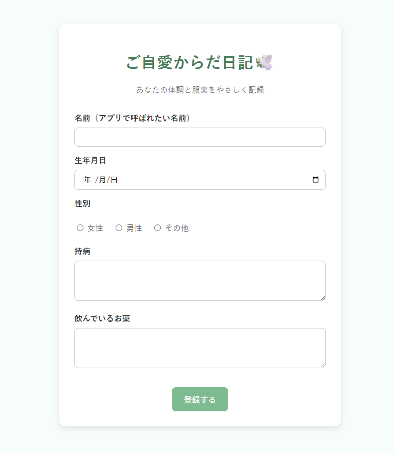
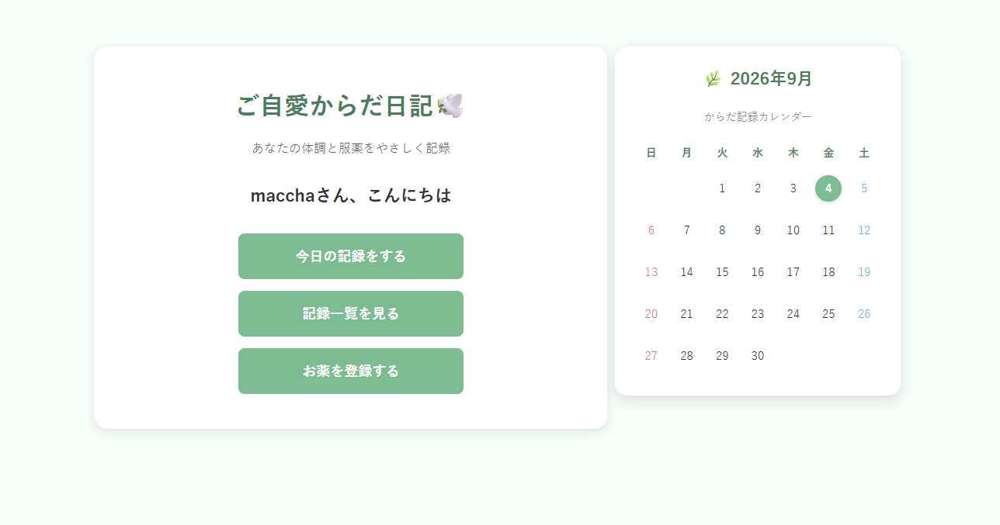
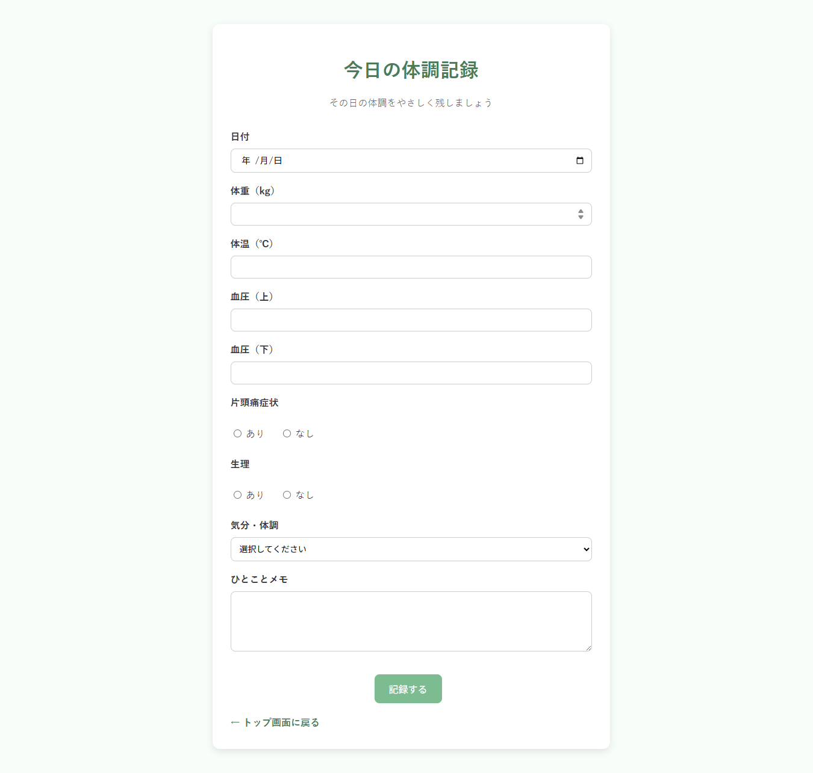
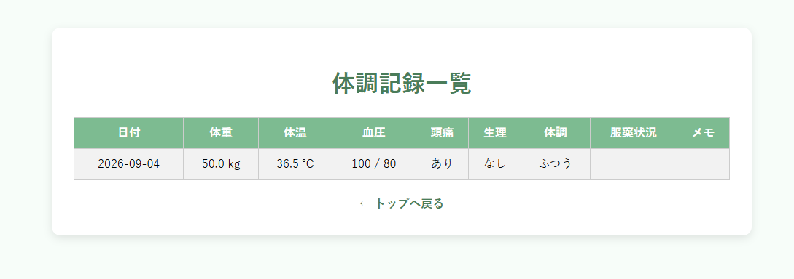
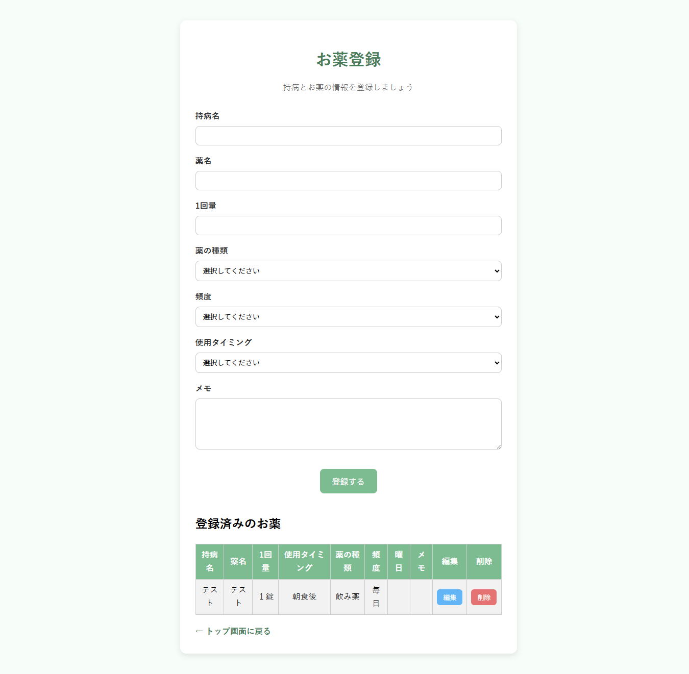

# ご自愛からだ日記 🕊️

体調と服薬情報を記録し、自分自身の変化を振り返るためのJava Webアプリです。

職業訓練で学んだJava、Servlet／JSP、HTML／CSS、SQLなどを、一つのWebアプリの中でどのように組み合わせるのかを実践するため、ポートフォリオとして個人制作しました。

> 本アプリは学習・ポートフォリオ目的の作品です。医療サービスとしての実運用を目的としたものではありません。

## 画面イメージ

### 利用者情報の初期登録画面



### トップ画面

利用者名の挨拶、各機能へのボタン、カレンダーを表示します。



### 体調記録画面



### 体調記録一覧画面



### お薬登録画面

登録フォームと、登録済みのお薬一覧を同じ画面に表示します。



## 制作背景・目的

制作者自身に複数の持病があり、毎日服用する薬や週1回使用する注射薬などを管理する中で、「今日は薬を飲んだか」「今週は注射を使用したか」を忘れずに記録したいと考えたことが制作のきっかけです。

また、薬の種類や量が変わることもあるため、体調と服薬情報を残しておき、後から次のような変化を振り返れるものを目指しました。

- この頃から体調が悪くなっていた
- この日は調子が良かった
- この時期に薬が変わった

持病があり、複数の薬を継続して使用・服用している方を想定しています。

「ご自愛からだ日記」という名前には、持病や服薬と付き合う中でも、自分の体と心を日々自分自身で大切にしてあげたい、という思いを込めました。白い鳥の「幸福」「希望」といったイメージから、体調に不安があるときにも少し前向きな気持ちになれるよう、アプリ名に🕊️を使用しています。

## 主な機能

### 利用者情報の初期登録

- アプリで呼ばれたい名前
- 生年月日
- 性別
- 持病
- 服用中の薬

入力内容はセッションに保存し、トップ画面の挨拶に名前を表示します。ID・パスワードを使用するアカウント登録機能ではありません。

### 体調記録

- 日付
- 体重
- 体温
- 血圧（上・下）
- 片頭痛の有無
- 生理の有無
- 気分・体調
- ひとことメモ

記録した内容はセッションに保存し、一覧画面で確認できます。ひとことメモは体調だけでなく、その日の出来事を日記のように残す用途も想定しています。

### 薬情報の管理

- 薬情報の登録・一覧表示
- 登録済み情報の編集・更新
- 削除前の確認表示と削除
- 持病名、薬名、1回量、薬の種類、使用頻度、曜日、使用タイミング、メモの管理

薬情報はH2 Databaseへ保存します。

### カレンダー表示

- 現在の年月に合わせたカレンダーの生成
- 今日の日付の強調表示
- 体調を記録した日への印の表示

## 薬の登録で工夫した点

継続して使う薬だけでなく、注射薬や必要時に使う薬も登録しやすいように、薬の種類・使用頻度・使用タイミングを選択式にしました。

| 項目 | 選択肢 |
| --- | --- |
| 薬の種類 | 飲み薬、注射、塗り薬、貼り薬、吸入、その他 |
| 使用頻度 | 毎日、毎週、必要時、頓服、その他 |
| 使用タイミング | 毎食後、必要時、朝食前・後、昼食前・後、夕食前・後、就寝前 |

使用頻度で「毎週」を選んだ場合だけ曜日欄を表示するよう、JavaScriptで画面を切り替えています。

## デザイン

体調に不安があるときでも使いやすい、やさしく落ち着きや癒しを感じられる画面を目指し、ミントグリーンを基調にしました。入力画面や一覧画面も同じ色調でそろえ、アプリ全体に統一感を持たせています。

## 使用技術・開発環境

| 分類 | 技術・環境 |
| --- | --- |
| 言語 | Java 21 |
| Web | Jakarta Servlet、JSP、HTML、CSS、JavaScript |
| データベース | H2 Database 2.4.240 |
| DB接続 | JDBC、SQL |
| アプリケーションサーバー | Apache Tomcat 10 |
| 開発環境 | Eclipse Dynamic Web Project |
| 文字コード | UTF-8 |
| ビルド管理 | Maven／Gradleは未使用 |

Javaクラスを`model`、`servlet`、`dao`に分け、役割を意識して構成しています。画面表示にはJSPを使用しています。

## プロジェクト構成

```text
gojiai-diary/
├── .classpath                 # Eclipseのクラスパス設定
├── .project                   # Eclipseのプロジェクト設定
├── .settings/                 # Java・Web・Tomcat関連の設定
├── .gitignore
├── docs/images/               # README掲載用のスクリーンショット
└── src/main/
    ├── java/
    │   ├── dao/               # H2 Databaseへのアクセス
    │   ├── model/             # 利用者・体調記録・薬情報のデータクラス
    │   └── servlet/           # 入力受付、登録、更新、削除、画面遷移
    └── webapp/
        ├── *.jsp              # 初期登録、トップ、体調記録、薬管理画面
        ├── META-INF/
        └── WEB-INF/lib/
            └── h2-2.4.240.jar
```

コンパイル時に生成される`build/`と`.class`ファイルは、`.gitignore`でGitの管理対象外にしています。

## 生成AIの活用

本アプリの制作では、ChatGPTを積極的に活用しました。

アプリのテーマ、解決したい課題、必要な機能、入力項目、画面構成、デザインは制作者自身で考え、ChatGPTとの対話を通じて仕様を具体化しました。また、アイデア整理や質問への回答だけでなく、コード生成にも活用しています。

生成されたコードはEclipse上のプロジェクトへ自分で反映し、実行・動作確認を行いながらアプリとして組み立てました。職業訓練で学んだ生成AIを活用したコード作成を、実際の自主制作に取り入れたものです。

## 制作を通して学んだこと

授業動画や参考書で個別に学んでいたJava、Servlet／JSP、HTML／CSS、SQLなどを一つのWebアプリとして組み合わせたことで、画面から受け取った入力がJavaの処理やデータベース操作につながり、再び画面へ表示されるまでの流れを実感できました。

分からない点はChatGPTへ質問・相談しながら進め、テーマや機能構成を考えるところから、生成されたコードの反映、実行、動作確認までを経験しました。

制作形態は個人制作、制作期間は約1週間です。

## 実行に必要な環境・設定

### 必要な環境

- JDK 21
- Eclipse
- Apache Tomcat 10
- H2 Database 2.4.240

H2のJARは、Maven／Gradleを使用していないため、`src/main/webapp/WEB-INF/lib/`に含めています。

### DB接続用の環境変数

DB接続情報はソースコードへ直接記載せず、次の環境変数から取得します。

```text
GOJIAI_DB_URL=<H2のJDBC接続URL>
GOJIAI_DB_USER=<H2のユーザー名>
GOJIAI_DB_PASSWORD=<H2のパスワード（使用する場合）>
```

`GOJIAI_DB_URL`と`GOJIAI_DB_USER`は設定が必要です。`GOJIAI_DB_PASSWORD`は、パスワードを使用する環境では設定してください。未設定の場合は、空文字（パスワードなし）が使用されます。

実行する環境に合わせて、EclipseまたはTomcatの実行設定へ値を登録してください。実際の接続情報を`.env`などへ保存する場合、そのファイルはGitHubへ登録しないでください。

### データベースについて

薬情報の保存には`MEDICINES`テーブルを使用します。コードから確認できる列は次のとおりです。

```text
ID
DISEASE_NAME
MEDICINE_NAME
DOSAGE
TIMING
FREQUENCY
DAY_OF_WEEK
MEDICINE_TYPE
MEMO
```

テーブル作成用SQLは本リポジトリに含まれていません。実行には、上記の列を持つH2の`MEDICINES`テーブルを事前に用意する必要があります。

## 現在の仕様・注意事項

- 利用者情報と体調記録はセッションに保存するため、セッション終了後も残る永続保存には対応していません。
- 薬情報はH2 Databaseへ保存します。
- カレンダーには記録日の印を表示しますが、日付を選択して記録を絞り込む機能は未実装です。
- 服薬状況を入力するための画面・処理は作成していますが、現在のコードではDBから取得した薬一覧をセッションへ連携する処理を確認できないため、主な実装済み機能には含めていません。
- ログイン・利用者認証を備えた実運用向けサービスではありません。

## 今後の改善案

- 利用者情報と体調記録のデータベース保存
- 登録した薬と体調記録画面の服薬チェック機能の連携
- 生理期間をカレンダー上で視覚的に確認できる表示
- カレンダーの日付による体調記録の絞り込み
- 最終利用日などに応じた挨拶メッセージの切り替え
  - 通常時：「○○さん、こんにちは」
  - 久しぶりに利用した場合：「○○さん、お久しぶりです」
- 入力チェックやセキュリティ対策の強化
- データベースの初期設定手順・テーブル作成SQLの整備
